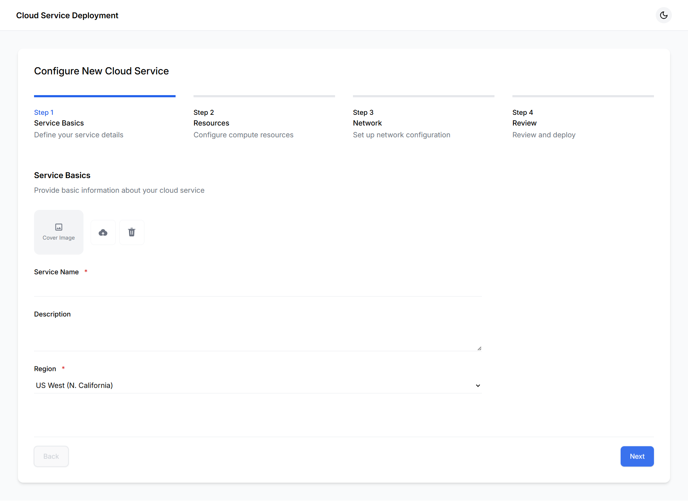
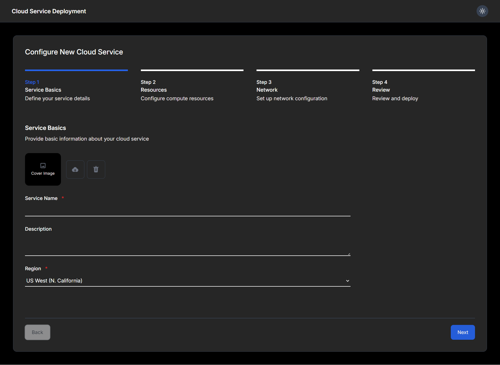

# Doprax


👉 [View the Live site](https://doprax-cloud-service.vercel.app)

### 🌓 Dark & Light Mode Comparison
| Light Mode | Dark Mode |
|------------|-----------|
|  |  |

This template should help get you started developing with Vue 3 in Vite.

## Recommended IDE Setup

[VSCode](https://code.visualstudio.com/) + [Volar](https://marketplace.visualstudio.com/items?itemName=Vue.volar) (and disable Vetur).

## Project Setup

```sh
npm install
```

### Compile and Hot-Reload for Development

```sh
npm run dev
```

### Compile and Minify for Production

```sh
npm run build
```
